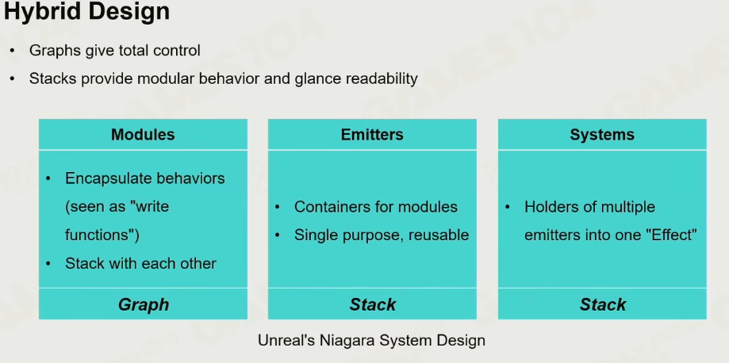
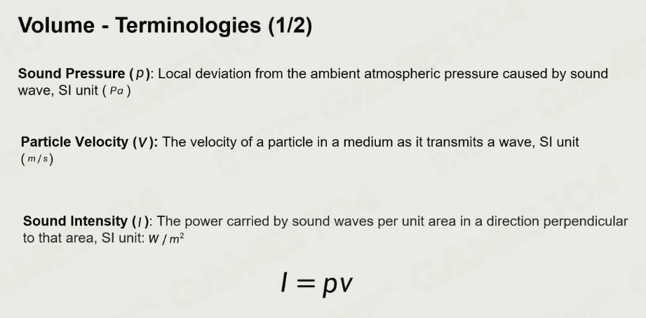
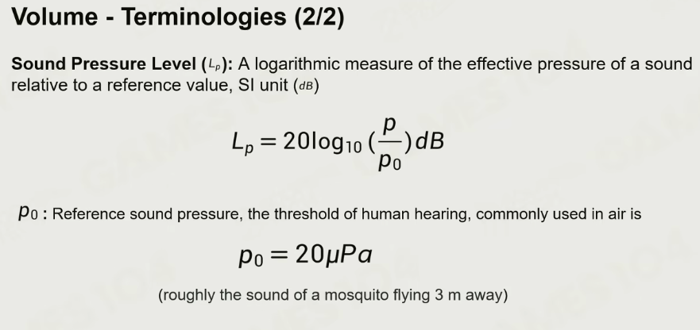
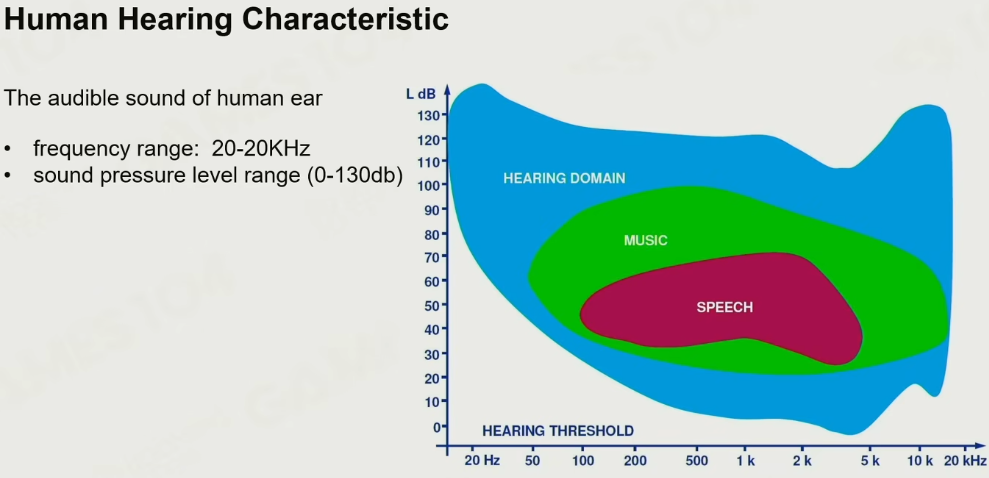

# 1.粒子系统

## 1.1 基础概念
* Emitter
发射器
* Particle System
把众多的Emitter结合到一起
> 游戏中的粒子系统的编辑核心就是如何组合Emitter

* Spawn Position
发射生成点
* Spawn Mode
生成的方式的种类，比如到达一定时机才进行Spawn发射
* Simulate
粒子在空间的行为
使用最简单的显式积分
旋转
重力和大小
一些物理特性，如落地的与地面相遇时反弹

* Billboard Particle
最古老，每个粒子都是sprite, 面向相机
如果尺寸大，建议用Animated texture，texture表面不断变化

* Mesh Particle
每个粒子都是Model， 碎片来自于爆炸

* Ribbon Particle
Particle拖出一条光带，如刀剑的拖尾的效果。
在飞行过程中会不断拉出一个个的控制点
使用Catmull-Rom 曲线，把曲线拉得更光滑

## 1.2 Rendering

* Particle Sort
Mode
1. Global的方式
对于整个System进行排序，性能消耗大
2. 通过层级
对于Per System -> Per Emitter -> Within emitter
规则：
1. 通过相机的远近来
2. 通过各自System的Bouning Box来

* Low-Resolution Particles
对于全Resolution的粒子，会导致严重的性能消耗。因此会把Resolution进行减半处理。
降低采样率

## 1.3 GPU粒子

* Processing Particle on GPU
  粒子系统的Simulate过程对于CPU的性能占用过大，放到GPU中处理。

* 实现概述
首先做一个池子，如下

生成粒子，终究从dead list的尾巴取数据

模拟过程

使用compute shader的原子性特征
进一步的，实现粒子的view culling的list支持，与dead与active列表区别开

* 排序
使用归并排序的思想

* 碰撞

## 1.4 粒子应用
* 人群模拟
1. 把人物做成一个Mesh，使用Animated Particle Mesh，支持skeleton动画
2. 把人物的原始动画制作成 Particle Animation Texture，再在particle system实现一个简易的ASM。
3. 人物移动时的Navigation Texture，使用SDF（有正负号的DF），随着值越来越接近零，就知道是否靠近障碍物。 有了SDF算出Direction Field(Texture)，对于一个点就有了一个指引性。再结合ASM里的随机量，实现状态切换模拟真实的情况。

* 实现动作-骨骼- 破坏等变换。 Unreal例子
* 与环境感知

## 1.5 粒子设计工具链
* Preset Stack-Style Modules
如unreal的Cascade PS 
传统的有界面有参数，通过叠加module的形式制作粒子。
缺点是固定的方法和流程，添加新的需要引擎中支持，固定的粒子数据不灵活

* Graph-Based Design
参数化与可共享化的graph的设计，类似于蓝图系统的搭建

* Hybrid Design
  如Unreal的Niagara System Design(引擎中近100万行代码实现)

# 2.Sound System

## 2.1 音量单位
音量来自于单位面积受到的音量压强

## 2.2 分贝
能感知的最小声音：一个蚊子离三米发出的声音，以此为基数，每十倍为一个台阶

## 2.3 音色
频率差不多，但多个不同的基波叠加

## 2.4 降噪
以两种波长互相抵消的方式

> 能识别20-50HZ，但实际高过50HZ时，也会产生绕动音色，实际在电影行业制作时是要高于50HZ的

