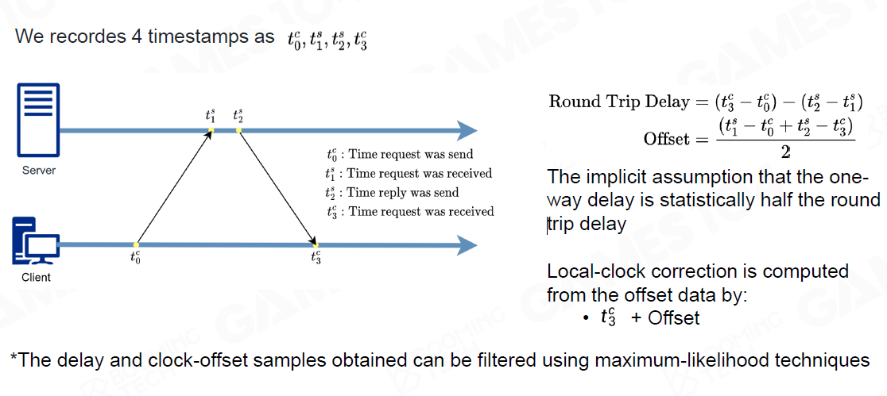

# 1. 引擎中的GamePlay玩法
GamePlay is Everything

## 1.1 总览
• Event Mechanism
• Script System
• Visual Script
• Character, Control and Camera

GamePlay的挑战
1. 各个子系统之间的协作
2. 对于一些游戏中，可能存在各种类型玩法
3. 如何针对市场情况，做出快速迭代

## 1.2 Event Mechanism

1. Publish-subscribe Pattern
* 发送者 -> 事件注册到Dispatcher
* Dispatcher送到各个GO中
* GO返回Callback
因此需要三个组件：
组件1： Event Definition
* 这里的问题是，游戏的玩法多样性导致无法从程序层面预先定义好类型。UE的解决方案下是允许自定义类，生成可编辑的界面。
* 但另一个问题是，这样还是会需要重编译代码，对于UE来说，允许一种C++代码编译出的DLL的注入机制。

组件2：Callback Registration
预先注册一个callback函数句柄，由某个时刻被Invoke。
* 问题，生命周期的问题，callback安全性问题，在invoke原指针地址已经被回收，wild point
* 强引用的做法：callback注册在对象不可能销毁！ 这样内存可能会越来越大。。
* 弱引用的做法：对象可以被销毁，但Invoke时，进行判定！

组件3：Event Dispatching
* 立即模式，父类的函数会一直等到callback后才能继续执行
问题，多同步的情况难以处理，对于游戏环境的添加特效，如果加载的事件放成立即，则会花费大量的事件在发送事件
* 消息队列， 先放到队列中，在未来某个时间点按顺序（或优先级）执行
1. 需要解决Event序列化和反序列化的问题，利用反射的机制，将Event与内存块之间进行相互转换。
2. 进一步的优化Event的内存，用Ring Buffer的方法，通过移动指针来管理内存池。


3. 消息队列进行分类， 对于复杂的Event来说，做出多个Dispatcher，多个Queue。如Net Event Queue, Combat Event Queue等，加强处理效率，也更易维护。
4. 问题1， 队列无法保存顺序问题
5. 问题2， 时效性问题，需要至少等一帧，无法立即处理。 如对于ACT游戏来说，实时性要求较高的情况。

> Event不建议添加优先级机制，这会导致耦合度的增加，同时也不符合dispatcher的优势，更难以处理并行化的设计。设置了优先级就会包含了大量的假设，也加大了与dispatcher的耦合度。

## 1.3 Game Logic的语言

* 编译型语言构建游戏逻辑
问题1： 更新迭代困难，每次修改都要重编
问题2： 使用门槛高，设计（非开发）人员几乎无法参加
* 脚本语言，解释型语言
在一个虚拟机的环境中运行


* 脚本管理系统
方案一： Native语言控制游戏主世界，拥有更高的性能。
方案二： 使用脚本语言控制
实际情况下，在重度脚本依赖的游戏中，GO的创建管理多数在于脚本中，因为游戏逻辑中GO的使用控制是相对更多的，而脚本主控的也是游戏逻辑部分，编译型语言则是提供基础功能的接口。

> 脚本语言的缺点是慢，但借助JIT（just-in-time），一边运行一边编译，以此种方式优化整个性能，甚至可以超过编译语言。
> 魔兽世界- 使用LUA

## 1.4 Visual Scripting
可视化编程语言
> 引擎的本质是生产力工具

* 将整个脚本语言转为可视化的过程
* 难点：主要还是团队协作的问题，这里有规范性的问题，debugger机制，手动整理过程低效耗时
* 本质上，就是可视化的脚本，需要能与脚本之间互相转换，但与脚本并不是一个替代关系。而更好的是一个互补的情况

## 1.5 3C系统
Character, Control & Camera
形成了游戏的体验的核心
* Character: 首先就是Movement，对于3A游戏来说，移动会有很多的细节。 其次是与环境的互动。一般来说由 状态机来实现。
* Control: 针对不同的设备的Input做出不同的对应响应，同时也需要反馈机制，另外对于一些ACT游戏，还需要设计不同的按键组合，这里有Chords，同时按下某些键，触发一个独特的行为，有Key Sequences，保留一段玩家的操作记录，以触发一个游戏行为。
> 多数的FPS游戏都配有一个吸咐系统，如果不做吸咐的话，由于操作的延迟可能会有100MS+，导致难以操作。

* Camera: 当角色在跑动走动时，相机也会随着发生变化。非常重要的一方面，根据生物学的原理，让相机表达出更好的主观感受。

# 2. AI

## 2.1 Outline
AI Basic
• Navigation
• Steering
• Crowd Simulation
• Sensing
• Classic Decision Making Algorithms
Advanced AI
• Planning and Goals
• Machine Learning

## 2.2 Navigation
导航系统分为 Map representation -> Path finding -> Path smoothing

### 2.2.1 Map representation - Walkable Area
确定所有可以去的区域
表达Walkable Area的格式：
1. Waypoint Network 路点网络
2. Grid
3. Navigation Mesh 
4. Sparse Voxel Octree 空间八叉树
有些情况需要在游戏中使用多种格式

* Waypoint Network
1. 找最近的点。Find the nearest points to get on and off the network
2. Plan the path on the waypoint network
实现容易，但限制性较多，路点选择需要手动介入

* Grid
统一标准划分，统一的格子形状。
实现容易，更易于更新，统一的数据格式。缺点是存储空间造成浪费，在Grid中移动时，可能会造成较严重的cache miss，另外实现桥路和地下叠加路线较为复杂，像素的精准度问题。

* Navigation Mesh
解决重叠路面问题，对比waypoint，这里使用的是面覆盖的方式，且支持3D walkable surface。更加精准，更快的寻路，动态性更好。但生成较为复杂，对于3维空间来说无法处理
使用Polygon，且必须得是凸Polygon(Convex Polygon)，而不是凹Polygon(Concave Polygon)。
原因：
1. Pathfinding generates a series of polygon
(Polygon Corridor) need to walk through，寻路形成一系列的多边形走廊，可能出现在多边形之外。
2. Convexity guarantees the final path is limited in
the polygon and two adjacent polygons have only
one common edge (Portal)。 两两个多边形之间仅有一个共享的边

* Sparse Voxel Octree
对于空战游戏，就可以使用八叉树的分类方式处理3维空间。问题是存储的空间要求较高，寻路较为困难


### 2.2.2 Pathfinding
所谓寻路的目标，1是找到一条可通达的道路，2是尽可能的找到相对近的路。
* 广度优先算法
  较费时

* 深度优先算法
  较费时

* Dijkstra 
每次遍历所有相邻的未访问过的点，找出与旧的点距离最短的点，直到找终点


* A星
  基本基于Dijkstra的思路，额外加入一个新的启发函数，cost等于source+启发
这里的启发函数可以理解为方向，如两点之间的直线距离，任意路径点与此直线距离的得到最终的cost.


Grid的启发算法：


NavMesh的A星启发算法：
1. 一般使用边线的中点


2. 计算欧拉距离


Heuristic的行为：
h(n) 过低，更慢，但容易找到最短路径，过高，更快点达到终点

### 2.2.3 Path smoothing
让AI走得更真实更自然

* Funnel Algorithm
类似于人走路的算法实现，先从一个点看向通道，找出相邻边的多边形，再判断是否与能完全包裹多边形，是则往下个多边形减少范围。 否则找到与下个多边形最近的边来减少范围查找。


### 2.2.4 NavMesh的生成
* Voxelization  体素化自动生成NavMesh
> 库Raycast: 先让世界进行体素化生成各个Voxel，标记出能通行的区域，通过相邻的Voxel不能相差的方式找出。 再从所有的walkable voxel中找出所有的Edge，再按这些的Edge生成Distance Field 图，每个voxel找最近的edge，离edge的点最远的点找出，再从这个点向外扩散，以此形成 Distance Field，即距离场。更细节的处理，比如重叠的区域需要做剔除。

* Region Segmentation

  

  

  

* Mesh生成
  通过 Region Segmentation生成 Mesh

  

### 2.2.5 NavMesh的特性
* 为不同的地形标记NavMesh
如水面，地面，沙面等，对不同的地形发送事件以做不同的游戏逻辑处理

* Tile 
对于场景物体来说，运用NavMesh的特性，生成不同的Tile，而不是完全更新NavMesh

* Off-mesh Link
允许在不同的地形之间的特殊行为。 因为在基础的NavMesh不足的情况，需要手动建立不同地形间的连接线，实现地形间的穿梭

## 2.3 Steering
转向系统
分为三种行为：
* 1. Seek Flee 目标转向  追寻一个目标的运动
追踪与巡逻。 输入：自己位置与目标位置  输出：加速度
* 2. VelocityMatch 速度转向
追上目标的速度，当目标是静止和匀速时，较为容易，可由加速度公式求出，但如果目标的速度是不定时，需要在第一帧进行动态计算
输入： 自己速度，目标速度，匹配时间    输出：加速度
* 3. Align  角度转向
与2类似，只是这里处理的是角速度的匹配。
输入：自己的角度，目标角度   输出：角加速度 

## 2.4 Crowd Simulation
群体（行为）模拟

### 2.4.1 模拟方法
* 1. Microscopic Models - Rule-based Models  微观方法
预先为群体动态的个体制定一系列的规则来运动
* 2. Macroscopic Models 宏观方法
宏观上设计全局的LINE，让群体是沿着LINE行走和运动，但不考虑个体之间和与环境之间的关联
* 3. Mesoscopic Models
混合模式
群体分组，个体可以按1的Role，整体就有一个LINE的规则，如RTS游戏控制小兵。

### 2.4.2 碰撞避免
Collision Avoidance
* Force-based Models
影响人群行为的社会心理和物理力量的混合， 个人的实际运动取决于所期望的速度及其与环境有关相互作用， 且可以模拟逃离人群恐慌的动态特征
优点：适合人群模拟    缺点：与物理模拟类似，需要控制好模拟的步伐，以防模拟出错的情况

* Velocity-base Models
基于速度障碍生成的碰撞检测
当两个物体要相遇时，会在速度域形成一个障碍，以让各自进行速度调整来避让碰撞。
根据周边物体的信息，在速度域上做出决定。
算法分类：
1. Velocity Obstacle (VO)
计算它自己的躲避速度，假设其他座席无响应
适用于静态和无响应的障碍
容易跑过头
可能会引起两个互相避让物体之间的振荡

2. Reciprocal Velocity Obstacle (RVO)
假设另一方正在使用相同的决策过程(相互合作)
双方都只走一半避免的碰撞的路
仅保证两个物体间的无振荡和碰撞避免的情况

3. Optimal Reciprocal Collision Avoidance (ORCA)
在2的基础上解决了群体的无振荡和碰撞避免的情况

## 2.5 Sensing or Perception
感知系统

### 2.5.1 分类
内部信息+ 外部信息（静态空间信息，动态空间信息，角色信息）
* 内部信息
自身的信息，位置，血量，武器状态等
* 静态空间信息
放置tactical（战略）点，让AI知道某些点可以做为更优的选择
* 动态空间信息
Influence Map + Sight Area（视角区域）
动态获取当前的游戏的信息或游戏行为变动或事件发出，以影响AI在战场上的行为。
Game Objects
动态获取场景物体的行为来影响 AI。

### 2.5.2 Sensing 模拟
1.空间中的光，声音， 气味
2.最大行驶距离
3.以不同的模式在空间和时间上衰减
视线被障碍物挡住
嗅觉范围会随着时间的推移而缩小
4.辐射场可以模拟传感信号
可以简化为影响图
该字段覆盖的代理可以感知信息

> Sensing需要在引擎中设置开放的级别，以此控制对于性能方向的考虑和控制


## 2.6 Classic Decision Making Algorithms
### 2.6.1 分类
六大算法：
前向算法
• Finite State Machine
• Behavior Tree

• Hierarchical Tasks Network
• Goal Oriented Action Planning
• Monte Carlo Tree Search
• Deep Learning

### 2.6.2 Finite State Machine
状态机，两个状态通过一定的条件进行切换状态。
Transition + State+ Conditions
State过多时，整个网络的复杂度会比较复杂。 
可以使用Hierachy FSM做为优化，但反应速度较慢，交互也会有问题。

整体来说：
维护复杂，更新修改State难，重用性较差。

### 2.6.3 Behavior Tree
Decision Tree 决策树
用行为树来模拟出人类的思想决策
* Execution Nodes
叶子结点，也是行为结点，处理一个单位的行为。拥有Fail, Success, Running三种状态
* Control Nodes
条件结点， 通过返回结果去决定后面的流程的走向
Sequence： 从左往右（从上往下）依次执行子树，直达有结点返回Fail或Running, 返回，或者当所有的结点都成功，则返回成功
Select: 从左往右（从上往下）依次执行子树，直达有结点返回Success或Running, 立即终止并返回，或者当所有的结点都失败，则返回失败
Parallel: 逻辑上同时开始执行所有的子树，只要有任意M个子树执行成功，则返回成功，有N-M+1个结点失败则失败。 其他则返回Running


* 如何去Tick?
要想人思考一样，每次从root结点去Tick， 每层的树结点按固定的顺序去执行，每个结点都要有固定的返回。 
> 从头Tick的可能会导致性能问题，这里的优化的方法可以是去以某些激活结点去执行，同时添加一些事件去让BT从头执行。但这只是一种变体且需要明确约定好规则和设计。
> 同时Running的结点可能有多个。

* 优化- Decorator
对于一个结点执行固定的几类动作， 如•循环执行 •执行一次 •计时器 •时间限制 •值修改器几种

* Precondition
把条件合并到结点内，以简化BT的结构

* Blackboard
BT的内存区，用K-V去存储数据，让行为树的结点去存取数据。

* BT的缺点
每个TICK都从头就会有性能问题。交互条件越多就越多的消耗。


# 3. 高级AI

## 3.1 HTN 层次任务网络
Hierarchical tasks
人类的行为是有意图的，有一定的目标性的，有层次的完成最终的目标。当设计师在构建AI时，更多的希望AI完成某一件事。

### 3.1.1 框架：


1. World state: 包含一系列的属性，给计划者AI的一个状态。
2. Sensors: 传感器，接收世界的变更来改变World state. Perception
3. HTN Domain: 资源里加载进来，用于描述HT之间的关系。
4. Planner: 从World State和HTN Domain中制定计划
5. Plan Runner: 运行Plan，在任务完成后更新world state 

### 3.1.2 任务：
* 1. Primitive task: 原子任务
先决条件Preconditions：  是否可以执行 + world properties的值是否可以满足。
执行Action： 任务的执行内容
影响Effects: 任务的执行会对world state properties的影响。 如改变某个数值

* 2. Compound task: 复合任务
包含多个methods， 每个method有自己优先级和先决条件，类似于BT的Selector的设定，按优先级找到满足先决条件的method执行。
这里的method又会包含多个子的原子任务或复合任务，以此实现更加复杂的嵌套关系。
> 通过这种方式的构建AI，更符合人类的思维方式

### 3.1.3 HTN Domain：
以Root Task为基，设定好各个method：


### 3.1.4 Planing：
第一步：
* 从Root task开始进入整个HTN。
* 按先决条件和优先级找到method
第二步：
* 执行原子任务，如果不满足条件就找下个任务，没有下个任务了则直接往上层返回失败。
* 对于执行复合任务，解开任务内容，按先决条件和优先级进行执行
> 这里需要注意的是，复合任务在执行过程中会对world state进行一个副本拷贝，在执行中的任务假设为成功完成且修改到这块值。

不断的重复第二步以完成整个Plan的制定。

### 3.1.5 Run Plan：
执行结束： 有一个任务执行失败了。或者是所有的都执行成功了。
成功则更新world state数据，否则返回失败，进入Replan的过程

### 3.1.6 Replaning：
三种情况触发replan
* 当前闲置状态
* 当前plan结束或失败了
* 传感器响应触发world state变更

### 3.1.7 总结：
优点：
与BT很类似，同时更高级别的抽象
可以制定有长期影响的计划
比BT更高效率
缺点：
玩家的行为难以预测，导致任务容易失败
一些world state和任务的结果，对于设计者来说构建会有挑战性


## 3.2 Goal-oriented Action Planning(GOAP)
更加动态，backward planning而非forward
### 3.2.1 框架
* World State和Sensors: 与HTN类似
* Goal set： 目标集
* Action set: 行为集
* Planning: 一系列的行为计划


### 3.2.2 Goal set
目标集是由所期望的最终的达成一个状态组成。
每一个目标也可以表示为一系列的状态。
* precondition: 先决条件，决定选哪一个goal
* Priority: 决定从多个goal中应该选哪个

### 3.2.3 Action set
包含一系列的Action，这里的Action与HTN的原子任务类似。
但多一个Cost概念，其中表示这一个Action所需的消耗值，由开发者设定。

### 3.2.4 执行流程
1. Goal Set中找到第一个执行的GOAL
2. 从第一个GOAL里的precondition里的world state中，与当前world state比较，得出不满足的条件，放到Unsatisfied States列表中
3. 从Unsatisfied State顶部取出一个state，从Action set找出可以得到此state的一个Action，如果找到了，则把这个state从unsatisfied State列表中取出，把Action加入Plan stack中。
4. 从Plan stack中拿到此Action，检测他的precondition条件，如果不满足，同样执行2，3这两步。
最终的目标是清空Stack of Unsatisfied States.

### 3.2.5 Build States-Action-Cost Graph
把GOAP转化为图的问题。 构建为有向图。
图的结点：连接的各个States， 是一组state的condition值
图的边：Action
图的距离：Cost
核心的问题： 从Goal到当前状态的一条最短路径！
使用A*算法解决，这里的启发函数可以使用unsatisfied states的个数。 但A*并不保证找到最优解。但这不影响，实际上AI也可以更灵活

### 3.2.6 总结
优点：
目标与行为分开了，较HTN更加灵活，同时HTN也容易犯precondition/effect不匹配的错误
缺点：
较BT/FSM/HTN来说，消耗更大了，计算更慢。
也需要一个很好的制定world state和action effect

## 3.3 Monte Carlo Tree Search
蒙特卡洛树搜索
2006年由Enrico Fermi 提出的方法，第一个要解决的目标就是围棋。
> 把问题抽象成数学模型，因为计算机只能处理数学模型

### 3.3.1 模型
* State: 当前的状态，通过一个node表示
* Action: AI的一步操作，表示为一个edge
* State Transfer: 从一个State到另一个State的Action
* State Space: A Tree Structured State Space。 一系列通过action与current state连通的states集合。根结点就是current state

整个模型的输入就是current state，构建出State Space， 输出就是从这个State Space中找出从current state 到best state的

### 3.3.2 模拟
* 模拟
根据默认策略从状态节点运行以产生结果

* 以围棋为例
从状态中随机移动直到游戏结束
根据结果返回1(赢)或0(输)

* 默认策略
有意义但快速的游戏规则或神经网络

### 3.3.3 对于state的评估
评价因素
•Q:模拟结果的累积
•N:模拟次数

评估的因素： Q/N 

### 3.3.4 反向传播 Backpropagate
对于当前模拟失败时，不仅仅要改自己的Q/N值，自己的父结点也要依次往上调整。 这样做了足够多的模拟时，所有探索过的结点都会有一组数据。

### 3.3.5 迭代步骤
选择: 选择最有希望的“可扩展”节点 （most urgent "expandable" node）
展开: 通过选择操作展开树
模拟: 从新节点进行模拟并产生一个结果
反向传播: 从新节点反向传播模拟结果

### 3.3.6 选择 Selection
* "expandable" node： 
未探索完的结点
* Selection
Exploitation: 开发型的
寻找有前景的领域
选择Q/N值较高的子节点
* Exploration: 探索型的，选择N值较小
查看尚未充分采样的区域
选择访问次数较少的孩子
* 如何平衡勘探与开发?
使用UCB (Upper Confidence Bounds)公式
𝑈𝐶𝐵𝑗:节点j的UCB值
𝑄𝑗:通过节点j的所有播放的总奖励
𝑁𝑗:节点j的访问次数
𝑁:节点j的父节点被访问的次数
𝐶:一个常数，调整以降低或增加探索执行的数量


* 如何选择最紧急的可扩展节点?
始终从根节点开始搜索
查找当前节点UCB值最高的子节点(有希望的子节点)
设置有希望的子节点为当前节点
重复以上步骤，直到当前节点是可展开的。设置当前节点为所选节点

* 扩展
根据可用的操作，将一个或多个新的子节点添加到选定的节点
子节点的值未知

* 基于扩展，模拟和反向传播
* 结束条件
1. 设定内存大小以结束
2. 设置计算时间

* 如何选择最好的招式?
当前状态节点的“最佳”子节点
Max child: 选择Q值最高的root child
Robust child: :选择N值最多的根节点
Max-Robust子: 选择访问次数和奖励最高的根子。如果不存在，则继续搜索，直到达到可接受的访问数
安全子: 选择LCB（Lower confidence bound）最大化的子


### 3.3.7 总结
优点：
MCTS代理行为多样
Agent完全由自己做出决策
可解决搜索空间大的问题
更加适合于回合制，结果比较明确的游戏结果

缺点：
对于复杂的游戏情况，如大多数即时游戏都很难设计动作和状态
很难为大多数实时游戏建模

## 3.4 Machine Learning Base
### 3.4.1 分类：
Supervised Learning: 监督式的学习
Unsupervised Learning: 非监督式的学习
Semi-supervised Learning: 半监督式的学习
Reinforcement learning: 强化学习

### 3.4.2 Supervised Learning
给定一些样本，从样本式学习，让机器可以进行识别。

### 3.4.3 Unsupervised Learning
从无标签的数据中进行学习，进行分类操作。

### 3.4.4 Semi-supervised Learning
半监督式的，给定一系列的无标签数据，并加以做好标签的样本进行学习。

### 3.4.5 Reinforcement learning
强化学习，从与环境的交互过程中学习
强化学习(RL)是机器学习的一个领域，研究智能代理在环境中应该如何采取行动，以最大化累积奖励的概念
* 试错法搜索 Trial-and-error
学习者必须通过尝试来发现哪些行为能产生最大的回报
* 延迟奖励
行为可能会影响即时奖励、下一个场合和所有后续奖励

### 3.4.6 Markov Decision Process
马尔可夫决策过程
* 基本元素：
1. Agent 代理
学习者和决策者
2. Environment 环境
与代理交互的对象，包括代理外部的所有内容
3. State
Agent的观察，数据结构是人为设计的状态
4. Action
行动是代理在游戏中所能表现的最小元素
5. Reward
从环境传递到代理的每个时间步骤中接收的特殊信号

* Mathematical Model 数学模型
Probability of transition: 概率函数， 在采取行动a后，从s到s‘的转换概率
Policy： AI系统的核心，类似于transition，policy也是一个随机变量。 AI的核心优化也是Policy， 无论是用神经网络还是
Total reward： 从长远来看，它所获得的累积回报。 但是由于有一定的概率性，所以这里乘上一个系数。𝐺𝑡=𝑅𝑡+1+𝛾𝑅𝑡+2+𝛾2𝑅𝑡+3+⋯  这个系数平衡短期目标和长期目标，系数调大就是更偏向短期。


## 3.5 构建高级游戏AI
在游戏AI中使用Machine Learning概率
> AlphaStar是DeepMind开发的一个电脑程序，可以玩电子游戏《星际争霸2》

### 3.5.1 DRL example
Deep Reinforcement Learning 深度强化学习， 需要定义如下概念：
1. State： 地图 + 游戏统计数据 + 各个单位实体 + 玩家数据
2. Action: 抽象化出来的行为， what+who+where+when
3. Reward： 奖励机制。 对于AlphaStar的方法直接获得的奖励+1/-1，配合以伪奖励输出与评论网络，范围控制在+1/-1以匹配直接奖励。 不同的奖励设定能帮助训练不同类型的agent，类似于“性格特征”。
4. NN design: neural network 神经网络，根据游戏的结构和逻辑，构建NN和网络选型
5. Trainning Strategy: 训练策略

### 3.5.2 NN
* 整体结构- AlphaStar
最下方的数据，往上放到不同的神经网络上，最终encode形成一个AI角色
Decoder: 把结果翻译为人类可理解的行动


* MLP Multi-Layer Perceptron 多层次感知器
对于定长的数据，最简单的多层神经网络。给一个输入就有一个输出。

* CNN Convolutional Neural Network 卷积神经网络
如结构上的ResNet， 主要针对图像的识别，游戏中识别出哪里有角色（怪物或者敌方）。

* Transfomer
用于处理大量的时间上不定长的数据，持续处理变长的变量

* LSTM Long-Short Term Memory
像人类一样的思考，这里主要是使AI记录或删除旧的数据。 结构上，汇总上述三个网络处理完的数据。

* NN Architecture Selection
对于各类数据的选择，如定长数据使用MLP， 不定长使用LSTM，Transformer, 图像数据使用ResNet，Raycast或Mesh数据。

### 3.5.3 Trainning Strategy
* 使用Supervised Learning，先让AI模仿人类，当然首先得输入AI大量的数据。
* Refeinforcement Learning
* AlphaStar的方式：Self Play & Adversarial
1. Main agents MA: 
目标: 成为最健壮和输出
35%与自己打，50%与各过去的agents打， 15%跟过去的MA打
2. League exploiters LE:  
目标： 发现过去所有代理(MA, LE, ME)的弱点
与所有过去的代理商(MA, LE, ME)的对抗
3. 主要剥削者[ME]
目标:发现当前MA代理的弱点
针对当前的MA代理

### 3.5.4 RL与SL
* SL： 监督式学习
需要高质量的数据，有时也需要更明确的行为
行为更像人类，但但可能不会超过人类专家数据， 往往也会有数据不足的问题

* RL：强化学习
强化学习通常被认为是最优的解决方案， 但RL model是困难的，而且算力的消耗较大，算出来的行为可能是不自然的。

* 如何选择： 如果奖励是足够密集的，用增强学习RL更易训练出好AI， 如果一个动作与奖励关联不直接，使用RL更难，SL则更适合。

* Hybrid: 全局观
机器学习是强大的。但的确比较昂贵。例如，deepmind花费2.5亿美元来完成alpha star，而复制需要1300万美元， 我们经常需要权衡DNN在类人点上的位置(整个战斗的一部分)。
因此在适当的场合，可以组合各种策略来制作AI。


# 4. 网络

## 4.1 概述
基础篇
1. 网络协议
2. TCP, UDP和可靠UDP
3. Clock Synchronization
4. 远程过程调用(RPC)
5. 网络拓扑
6. 游戏同步
* 快照同步。
* 帧同步。
* 状态同步。

## 4.2 网络分层
Application 层
•Provides functions to users
Presentation 层
•Converts different representations
Session 层
•Manages task dialogs
Transport 层
•Provides end-to-end delivery
Network 层
•Sends packets over multiple links
Data Link 层
•Sends frames of information
Physical 层
•Sends bits as signals

## 4.3 TCP 与UDP
### 4.3.1 相关概念
TCP: 特点：
•Connection-Oriented
•Reliable and Ordered
•Flow Control
•Congestion Control
包头10个字节。
前面的操作如果没发出去，后面的消息就不会发。

UDP:特点：
•Connectionless
•UnReliable and Unordered
•NO Flow Control
•NO Congerstion Control
包头只需4个字节，更小。

* Positive acknowledgment (ACK) 信号： 在通信过程中，接收方向发送方发送的信号，表示已经正确地接收到数据。
* Negative ACK (NACK or NAK) 信号： 在通信过程中，接收方向发送方发送的信号，表示先前接收到的数据存在问题或出现了错误
* Sequence number (SEQ)是一种计数器，用于跟踪由主机发送的每个字节。
* Timeoutsspecified 是指在通信过程中等待接收方的确认信息的时间，如果在规定的时间内没有接收到确认信息，发送方会认为通信出现了问题，可能会尝试重新发送数据或采取其他措施来解决问题

### 4.3.2 如何构建一个游戏里使用的网络协议 
首先：对于游戏来说： 需要使用UDP，但又需要TCP的一些特性：
•Keep-alivedconnection (TCP)
•Need keep logic consistency in “order” (TCP)
•High responsive & low latency (UDP)
•Broadcast commonly used (UDP)
> 在彼此不可靠的链接下，怎么建立一个可靠的通信


1. 可靠性：（Auto Repeat Request）ARQ的策略：
•Stop-and-Wait ARQ 停止等待每个窗口返回
•Go-Back-N ARQ  检查到如果哪个丢了，就返回到对应窗口进行重传
•Selective Repeat ARQ  接收者每帧发送ACK，当接收者收到破坏的包时，将发送nack，发送者将重新传

2. 错误修正：在丢包的情况下让UDP变得可靠
* Forward Error Correction
算法1： XOR FEC
可以处理较小的丢包率
利用异或校验位的特点，额外在FEC Layer里存储异或位。
在二进制位上，如果两者不一样才会返回1，否则返回0。 
```
C= A xorB
A= Axor(BxorB) = (AxorB) xorB= CxorB
B= (AxorA) xorB= AxorC
```
对于ABCD四个包传输时，额外传输一个E，E里存储异或值，这样在丢失一个包时，可以通过异或的特点自动找回。

算法2： Reed-Solomon Codes（RS码）
构建的一个矩阵，中间任意抽掉若干行之后，还是一个可逆的矩阵，这样拿到信息后只需要乘上抽掉行后的矩阵的逆，就可以得到修复的数据。

3. 实时性：
•Smaller RTO growth
•No congestion control
•Fast retransmission mechanism
•No delay ACK

4. 灵活性：
灵活的设计协议
UDP和TCP混合使用

## 4.4 时钟同步
RTT： Round Trip Time
发送/接收 delay，传输 delay， 服务器响应时间
与PIng值不同，ping更偏向于传输层，RTT则是应用层级别。
与Latency对比，latency表示一个trip来回的从发送到接收的所需时间

NTP算法：


对于游戏引擎时同步时，第一步需要把时针对上：
Stream-Based Time Synchronization with Elimination of Higher Order Modes：
（SHM）是一种时间同步算法，主要用于无线传感器网络中的节点之间时间同步。SHM算法通过采用相邻的时间差进行时间同步，并通过消除多项式高阶模式来提高同步精度。下面将详细描述SHM算法的实现过程。
1. 首先进行一些N次NTP算法校准。
2. 把N次NTP结果中的RTT过大的样本去除
3. 再用2的结果的平均值，再进行一次NTP校准

## 4.5 Remote Procedure Call（RPC）
RPC的基本思想是在客户端和服务器之间建立一个虚拟的通道，使得客户端对远程服务器中的过程调用就像本地过程调用一样简单。
RPC是一种简单而实用的远程过程调用协议，可以在不同的计算机上执行远程调用，使得客户端对远程服务器中的过程调用就像本地过程调用一样简单。RPC被广泛应用于分布式系统、云计算、微服务等领域。
1. 定义接口
在客户端和服务器之间进行RPC调用之前，需要定义接口（即服务契约），包括要调用的方法的名称、参数和返回值类型等。接口通常使用IDL（接口定义语言）进行定义。

2. 序列化和反序列化
在RPC调用期间，客户端将请求参数序列化为字节流，然后通过网络传输到服务器。服务器收到请求参数后，将其反序列化，并根据请求参数执行相应的过程调用。同样地，服务器将返回值序列化为字节流，并通过网络传输到客户端，客户端收到返回值后将其反序列化。

3. 远程过程调用
客户端通过调用本地代理方法来发起RPC调用。代理方法将调用信息打包并通过网络发送给远程服务器，服务器收到调用信息后执行相应的过程调用，然后将结果返回给客户端。

4. 协议栈
RPC的实现需要一组协议栈来支持基础通信功能，包括传输层协议（如TCP、UDP）、网络层协议（如IP）和数据链路层协议（如Ethernet）等。

Interface Definition Language（IDL）是一种用于定义软件组件接口的语言。IDL通常用于分布式系统、远程过程调用、CORBA等场景中，可以帮助开发人员定义清晰、可扩展和跨平台的接口。下面将详细描述IDL的主要特点和应用场景。

RPC Stubs：是在客户端和服务器端之间进行通信时生成的代理程序，主要用于隐藏远程过程调用的实现细节，使得客户端对远程服务器上的过程调用就像本地过程调用一样简单。
使用Stub Compiler

## 4.6 Original Peer-to-Peer(P2P)

* 早期对战游戏的网络
现在多人已经少用了，一般用于点对点两位玩家来做

* P2P with Host Server
玩家做为一个服，创建局域网
> 早期的如CS，魔兽等局域网对战

* 好处： 不依赖服务器

## 4.7 Delicated Server

有一个核心的服务器，更加的有权威性，能更好的模拟游戏世界 ，但需要更高的性能需求

> 对于网速有要求的情况，如RTT（网络回路） 过高，则可以建立更高速的链接来处理

## 4.8 Game Synchronization

游戏同步：
单机：对于一个玩家（单机）的游戏来说， 只会如图中的流程：


联网：
引入如何去同步的问题呢？
1. Snapshot
古老，Quake时代就有， 客户端把输入发给服务器，服务器把所有状态生成快照发给各个客户端。客户端根据服务器的快照进行同步。

> 优点： 所有的状态和表现都是高度一致的。
> 缺点：快照的成本较高，这时服务器的帧率就要限制一下。客户端的算力被大量浪费，同时数据量随时游戏逻辑越复杂而变得巨大。
> 为了性能考虑，往往需要在快照之间添加差值来节省性能。


2. Lockstep
3. State Synchornization


