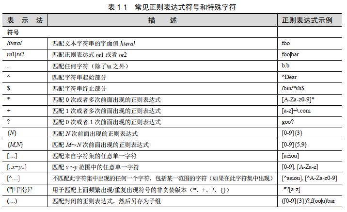
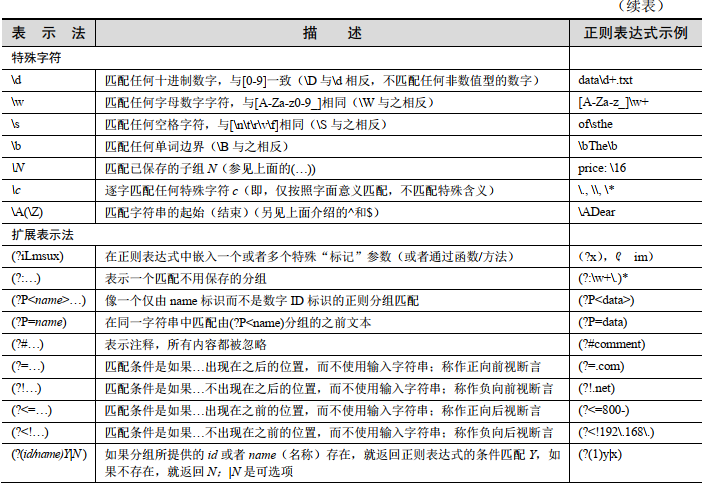

## Regular Expression



## match() & search()
```
import re
m = re.match('\d','a541')
if m is not None:
    print(m.group())
else:
    print("none found")
	
## none found

import re
m = re.match('\d','a541')
if m is not None:
    print(m.group())
else:
    print("none found")
	
## 5
```
```
import re
m = re.search('..[\d]{1,3}','\na51')
if m is not None:
    print(m.group())
else:
    print("none found")
# . 匹配除\n外的任意字符，其他如\t,\.都可以
```

## 分组
```
import re
m = re.search('\w+@(\w+\.)*(\w+)*\.com','aaa@aa.a.com')
if m is not None:
    print(m.group())
else:
    print("none found")
```

## sub() & subn()
```
#使用函数作为参数
def repl_t(txt):
    if txt.group(0) == '-':
        return 'x'
    elif txt.group(0) == '--':
        return '-'
    elif txt.group(0) == '-1':
        return '\"good\"'
m = re.subn('(-{1,2})\d?',repl_t,"d----asf-s-a-123")
print(m)
```

### Regular Expression -> Split()
```
data = (
 'Mountain View, CA 94040',
 'Sunnyvale, CA',
 'Los Altos, 94023',
 'Cupertino 95014',
 'Palo Alto CA',
 )

for d in data:
     v = re.split(r", |(?= (?:\d{5}|[A-Z]{2})) ",d)
     print(v)
```

### 扩展表达式
// 前瞻：
exp1(?=exp2) 查找exp2前面的exp1
// 后顾：
(?<=exp2)exp1 查找exp2后面的exp1
// 负前瞻：
exp1(?!exp2) 查找后面不是exp2的exp1
// 负后顾：
(?<!exp2)exp1 查找前面不是exp2的exp1

要理解?:则需要理解捕获分组和非捕获分组的概念：

+ ()表示捕获分组，()会把每个分组里的匹配的值保存起来，使用$n(n是一个数字，表示第n个捕获组的内容)
+ (?:)表示非捕获分组，和捕获分组唯一的区别在于，非捕获分组匹配的值不会保存起来
```
m = re.findall(r'(?<!YES)yes','YESyes? YESYes . YESyesYES!! ')
print(m)

m = re.sub('\B(?=(?:\d{3})+(?!\d))',',',"123456789")
print(m)
```
?i ignorecase
?m multi-line search
```
m = re.findall(r'(?m)(^th[\w ]+)', """
This line is the first,
another line,
that line, it's the best
""")

print(m)
```
