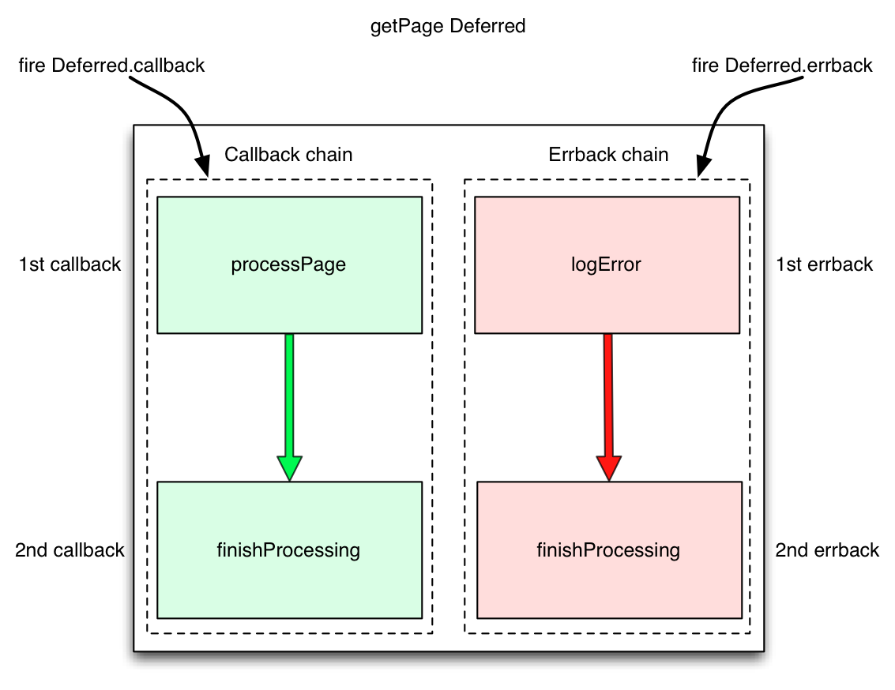

## Twisted


### Python Twisted介绍
Twisted是用Python实现的基于事件驱动的网络引擎框架。Twisted诞生于2000年初，在当时的网络游戏开发者看来，无论他们使用哪种语言，手中都鲜有可兼顾扩展性及跨平台的网络库。Twisted的作者试图在当时现有的环境下开发游戏，这一步走的非常艰难，他们迫切地需要一个可扩展性高、基于事件驱动、跨平台的网络开发框架，为此他们决定自己实现一个，并从那些之前的游戏和网络应用程序的开发者中学习，汲取他们的经验教训。

Twisted支持许多常见的传输及应用层协议，包括TCP、UDP、SSL/TLS、HTTP、IMAP、SSH、IRC以及FTP。就像python一样，Twisted也具有“内置电池”（batteries-included）的特点。Twisted对于其支持的所有协议都带有客户端和服务器实现，同时附带有基于命令行的工具，使得配置和部署产品级的Twisted应用变得非常方便。

### 为什么需要Twisted
2000年时，Twisted的作者Glyph正在开发一个名为Twisted Reality的基于文本方式的多人在线游戏。这个游戏采用Java开发，里面尽是一堆线程——每个连接就有3个线程处理。处理输入的线程会在读操作上阻塞，处理输出的线程将在一些写操作上阻塞，还有一个“逻辑”线程将在等待定时器超时或者事件入队列时休眠。随着玩家们在虚拟世界中移动并交互时，线程出现死锁，缓存被污染，程序中的加锁逻辑几乎从来就没对过——采用多线程使得整个软件变得复杂、漏洞百出而且极难扩展。

为了寻求其他的解决方案，作者发现了Python，特别是Python中用于对流式对象比如socket和pipe进行多路I/O复用的select模块（UNIX规范第3版（SUSv3）描述了select）。那时，Java并没有提供操作系统的select接口或者任何其他的异步I/O API（针对非阻塞式I/O的包java.nio已经在J2SE 1.4中加入了，2002年发布）。通过用Python中的select模块快速搭建起游戏的原型，这迅速降低了程序的复杂度，并且比多线程版本要更加可靠。

Glyph迅速转向了Python、select以及基于事件驱动的编程。他使用Python的select模块为游戏编写了客户端和服务器。但他想要的还不止于此。从根本上说，他希望能将网络行为转变为对游戏中的对象的方法调用。如果你能在游戏中收取邮件会怎样，就像Nethack mailer这种守护进程一样？如果游戏中的每位玩家都拥有一个主页呢？Glyph发现他需要优秀的IMAP以及HTTP客户端和服务器的Python实现，而这些都要采用select。

他首先转向了Medusa，这是一个在90年代中期开发的平台，在这里可以采用Python中的asyncore模块来编写网络服务。asyncore是一个异步化处理socket的模块，在操作系统的select API之上构建了一个调度器和回调接口。

这对于Glyph来说是个激动人心的发现，但Medusa有两个缺点：
1. 这个项目到2001年就不再维护了，那正是glyph开发Twisted Reality的时候。
2. asyncore只是对socket的一个薄封装层，应用程序的编写者仍然需要直接操作socket。这意味着程序可移植性的担子仍然落在程序员自己身上。此外，那时asyncore对Windows的支持还有问题，Glyph希望能在Windows上运行一个带有图形用户界面的客户端。
Glyph需要自己实现一个网络引擎平台，而且他意识到Twisted Reality已经打开了问题的大门，这和他的游戏一样有趣。

随着时间的推移，Twisted Reality这个游戏就演化成了Twisted网络引擎平台。它可以做到当时Python中已有的网络平台所无法做到的事情：
+ 使用基于事件驱动的编程模型，而不是多线程模型。
+ 跨平台：为主流操作系统平台暴露出的事件通知系统提供统一的接口。
+ “内置电池”的能力：提供流行的应用层协议实现，因此Twisted马上就可为开发人员所用。
+ 符合RFC规范，已经通过健壮的测试套件证明了其一致性。
+ 能很容易的配合多个网络协议一起使用。
+ 可扩展。

### Twisted架构概览
Twisted是一个事件驱动型的网络引擎。由于事件驱动编程模型在Twisted的设计哲学中占有重要的地位，因此这里有必要花点时间来回顾一下究竟事件驱动意味着什么。

事件驱动编程是一种编程范式，这里程序的执行流由外部事件来决定。它的特点是包含一个事件循环，当外部事件发生时使用回调机制来触发相应的处理。另外两种常见的编程范式是（单线程）同步以及多线程编程。

在单线程同步模型中，任务按照顺序执行。如果某个任务因为I/O而阻塞，其他所有的任务都必须等待，直到它完成之后它们才能依次执行。这种明确的执行顺序和串行化处理的行为是很容易推断得出的。如果任务之间并没有互相依赖的关系，但仍然需要互相等待的话这就使得程序不必要的降低了运行速度。

在多线程版本中，这3个任务分别在独立的线程中执行。这些线程由操作系统来管理，在多处理器系统上可以并行处理，或者在单处理器系统上交错执行。这使得当某个线程阻塞在某个资源的同时其他线程得以继续执行。与完成类似功能的同步程序相比，这种方式更有效率，但程序员必须写代码来保护共享资源，防止其被多个线程同时访问。多线程程序更加难以推断，因为这类程序不得不通过线程同步机制如锁、可重入函数、线程局部存储或者其他机制来处理线程安全问题，如果实现不当就会导致出现微妙且令人痛不欲生的bug。

在事件驱动版本的程序中，3个任务**交错执行**，但仍然在一个单独的线程控制中。当处理I/O或者其他昂贵的操作时，注册一个回调到事件循环中，然后当I/O操作完成时继续执行。回调描述了该如何处理某个事件。事件循环轮询所有的事件，当事件到来时将它们分配给等待处理事件的回调函数。这种方式让程序尽可能的得以执行而不需要用到额外的线程。事件驱动型程序比多线程程序更容易推断出行为，因为程序员不需要关心线程安全问题。

当我们面对如下的环境时，事件驱动模型通常是一个好的选择：

程序中有许多任务，而且…
1. 任务之间高度独立（因此它们不需要互相通信，或者等待彼此）而且…
2. 在等待事件到来时，某些任务会阻塞。
3. 当应用程序需要在任务间共享可变的数据时，这也是一个不错的选择，因为这里不需要采用同步处理。

网络应用程序通常都有上述这些特点，这使得它们能够很好的契合事件驱动编程模型。

###### **重用已有的应用**
在Twisted创建之前就已经有了许多针对多种流行的网络协议的客户端和服务器实现了。为什么Glyph不直接用Apache、IRCd、BIND、OpenSSH或者任何其他已有的应用，而要为Twisted从头开始重新实现各个协议的客户端和服务器呢？

问题在于所有这些已有的实现都存在有从头写起的网络层代码，通常都是C代码。而应用层代码直接同网络层耦合在一起，这使得它们非常难以以库的形式来复用。当要一起使用这些组件时，如果希望在多个协议中暴露相同的数据，则它们必须以黑盒的形式来看待，这使得开发者根本没机会重用代码。此外，服务器和客户端的实现通常是分离的，彼此之间不共享代码。要扩展这些应用，维护跨平台的客户端-服务器兼容性的难度本不至于这么大。

Twisted中的客户端和服务器是用Python开发的，采用了一致性的接口。这使得开发新的客户端和服务器变得很容易实现，可以在客户端和服务器之间共享代码，在协议之间共享应用逻辑，以及对某个实现的代码做测试。

###### **React模式**
Twisted实现了设计模式中的反应堆（reactor）模式，这种模式在单线程环境中调度多个事件源产生的事件到它们各自的事件处理例程中去。

Twisted的核心就是reactor事件循环。Reactor可以感知网络、文件系统以及定时器事件。它等待然后处理这些事件，从特定于平台的行为中抽象出来，并提供统一的接口，使得在网络协议栈的任何位置对事件做出响应都变得简单。

基本上reactor完成的任务就是：
```
while True:
    timeout = time_until_next_timed_event()
    events = wait_for_events(timeout)
    events += timed_events_until(now())
    for event in events:
        event.process()
```

Twisted目前在所有平台上的默认reactor都是基于poll API的（UNIX规范第3版（SUSv3）中描述）。此外，Twisted还支持一些特定于平台的高容量多路复用API。这些reactor包括基于FreeBSD中kqueue机制的KQueue reactor，支持epoll接口的系统（目前是Linux 2.6）中的epoll reactor，以及基于Windows下的输入输出完成端口的IOCP reactor。

在实现轮询的相关细节中，Twisted需要考虑的包括：

+ 网络和文件系统的限制
+ 缓冲行为
+ 如何检测连接丢失
+ 出现错误时的返回值

Twisted的reactor实现同时也考虑了正确使用底层的非阻塞式API，并正确处理各种边界情况。由于Python中没有暴露出IOCP API，因此Twisted需要维护自己的实现。

###### **管理回调链**

回调是事件驱动编程模型中的基础，也是reactor通知应用程序事件已经处理完成的方式。随着程序规模不断扩大，基于事件驱动的程序需要同时处理事件处理成功和出错的情况，这使得程序变得越来越复杂。若没有注册一个合适的回调，程序就会阻塞，因为这个事件处理的过程绝不会发生。出现错误时需要通过应用程序的不同层次从网络栈向上传递回调链。

下面是两段Python伪码，分别是同步和异步模式下获取URL的玩具代码。让我们相互比较一下这两个版本，看看基于事件驱动的程序有什么缺陷：

以同步的方式获取URL：

```
import getPage

def processPage(page):
    print page

def logError(error):
    print error

def finishProcessing(value):
    print "Shutting down..."
    exit(0)

url = "http://google.com"
try:
    page = getPage(url)
    processPage(page)
except Error, e:
    logError(error)
finally:
    finishProcessing()
```
以异步的方式获取URL：
```
from twisted.internet import reactor
import getPage

def processPage(page):
    print page
    finishProcessing()

def logError(error):
    print error
    finishProcessing()

def finishProcessing(value):
    print "Shutting down..."
    reactor.stop()

url = "http://google.com"
# getPage takes: url, 
# success callback, error callback
getPage(url, processPage, logError)

reactor.run()
```

在异步版的URL获取器中，reactor.run()启动reactor事件循环。在同步和异步版程序中，我们假定getPage函数处理获取页面的工作。如果获取成功就调用processPage，如果尝试获取页面时出现了Exception（异常），logError就得到调用。无论哪种情况，最后都要调用finishProcessing。

异步版中的logError回调正对应于同步版中的try/except块。对processPage的回调对应于else块，无条件回调的finishProcessing就对应于finally块。

在同步版中，代码结构直接显示出有一个try/except块，logError和processPage这两者间只会取其一调用一次，而finishProcessing总是会被调用一次。在异步版中需要由程序员自己负责正确调用成功和失败情况下的回调链。如果由于编程错误，在processPage或者logError的回调链之后没有调用finishProcessing，reactor事件循环将永远不会停止，程序就会卡住。

这个玩具式的例子告诉我们在开发Twisted的头几年里这种复杂性令程序员感到非常沮丧。而Twisted应对这种复杂性的方式是新增一个称为Deferred（延迟）的对象。

###### Deferreds
Deferred对象以抽象化的方式表达了一种思想，即结果还尚不存在。它同样能够帮助管理产生这个结果所需要的回调链。当从函数中返回时，Deferred对象承诺在某个时刻函数将产生一个结果。返回的Deferred对象中包含所有注册到事件上的回调引用，因此在函数间只需要传递这一个对象即可，跟踪这个对象比单独管理所有的回调要简单的多。

Deferred对象包含一对回调链，一个是针对操作成功的回调，一个是针对操作失败的回调。初始状态下Deferred对象的两条链都为空。在事件处理的过程中，每个阶段都为其添加处理成功的回调和处理失败的回调。当一个异步结果到来时，Deferred对象就被“激活”，那么处理成功的回调和处理失败的回调就可以以合适的方式按照它们添加进来的顺序依次得到调用。

异步版URL获取器采用Deferred对象后的代码如下：
```
from twisted.internet import reactor
import getPage

def processPage(page):
    print page

def logError(error):
    print error

def finishProcessing(value):
    print "Shutting down..."
    reactor.stop()

url = "http://google.com"
deferred = getPage(url) # getPage returns a Deferred
deferred.addCallbacks(success, failure)
deferred.addBoth(stop)

reactor.run()
```

在这个版本中调用的事件处理函数与之前相同，但它们都注册到了一个单独的Deferred对象上，而不是分散在代码各处再以参数形式传递给getPage。

Deferred对象创建时包含两个添加回调的阶段。第一阶段，addCallbacks将 processPage和logError添加到它们各自归属的回调链中。然后addBoth再将finishProcessing同时添加到这两个回调链上。用图解的方式来看，回调链应该如图所示：


Deferred对象只能被激活一次，如果试图重复激活将引发一个异常。这使得Deferred对象的语义相当接近于同步版中的try/except块。从而让异步事件的处理能更容易推断，避免由于针对单个事件的回调调用多了一个或少了一个而产生微妙的bug。

理解Deferred对象对于理解Twisted程序的执行流是非常重要的。然而当使用Twisted为我们提供的针对网络协议的高层抽象时，通常情况下我们完全不需要直接使用Deferred对象。

Deferred对象所包含的抽象概念是非常强大的，这种思想已经被许多其他的事件驱动平台所借用，包括jQuery、Dojo和Mochikit。


###### Transports
Transports代表网络中两个通信结点之间的连接。Transports负责描述连接的细节，比如连接是面向流式的还是面向数据报的，流控以及可靠性。TCP、UDP和Unix套接字可作为transports的例子。它们被设计为“满足最小功能单元，同时具有最大程度的可复用性”，而且从协议实现中分离出来，这让许多协议可以采用相同类型的传输。Transports实现了ITransports接口，它包含如下的方法：

>write                   以非阻塞的方式按顺序依次将数据写到物理连接上
writeSequence           将一个字符串列表写到物理连接上
loseConnection          将所有挂起的数据写入，然后关闭连接
getPeer                 取得连接中对端的地址信息
getHost                 取得连接中本端的地址信息

将transports从协议中分离出来也使得对这两个层次的测试变得更加简单。可以通过简单地写入一个字符串来模拟传输，用这种方式来检查。

###### Protocols

Protocols描述了如何以异步的方式处理网络中的事件。HTTP、DNS以及IMAP是应用层协议中的例子。Protocols实现了IProtocol接口，它包含如下的方法：
>makeConnection               在transport对象和服务器之间建立一条连接
connectionMade               连接建立起来后调用
dataReceived                 接收数据时调用
connectionLost               关闭连接时调用

我们最好以一个例子来说明reactor、protocols以及transports这三者之间的关系。以下是完整的echo服务器和客户端的实现，首先来看看服务器部分：
```
from twisted.internet import protocol, reactor

class Echo(protocol.Protocol):
    def dataReceived(self, data):
        # As soon as any data is received, write it back
        self.transport.write(data)

class EchoFactory(protocol.Factory):
    def buildProtocol(self, addr):
        return Echo()

reactor.listenTCP(8000, EchoFactory())
reactor.run()
```
接着是客户端部分：
```
from twisted.internet import reactor, protocol

class EchoClient(protocol.Protocol):
    def connectionMade(self):
        self.transport.write("hello, world!")

def dataReceived(self, data):
    print "Server said:", data
        self.transport.loseConnection()

def connectionLost(self, reason):
    print "connection lost"

class EchoFactory(protocol.ClientFactory):
    def buildProtocol(self, addr):
        return EchoClient()

def clientConnectionFailed(self, connector, reason):
    print "Connection failed - goodbye!"
        reactor.stop()

def clientConnectionLost(self, connector, reason):
    print "Connection lost - goodbye!"
        reactor.stop()

reactor.connectTCP("localhost", 8000, EchoFactory())
reactor.run()
```
运行服务器端脚本将启动一个TCP服务器，监听端口8000上的连接。服务器采用的是Echo协议，数据经TCP transport对象写出。运行客户端脚本将对服务器发起一个TCP连接，回显服务器端的回应然后终止连接并停止reactor事件循环。这里的Factory用来对连接的双方生成protocol对象实例。两端的通信是异步的，connectTCP负责注册回调函数到reactor事件循环中，当socket上有数据可读时通知回调处理。

###### Protocols