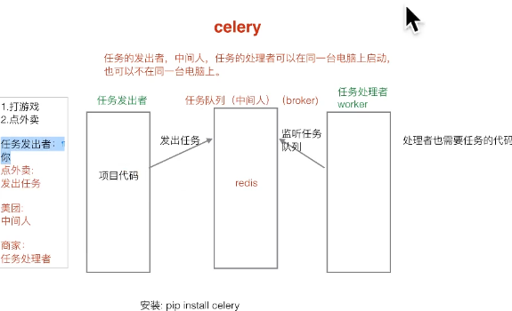

## 相关背景概念

> B2B, O2O, B2C, C2C..

## 数据库设计


> 对数据库进行授权
> 

> 使用后台管理
>


## 项目搭建

**1.一个模块对应一个APP**
**2.将所有app归类到一个apps文件夹**
**3.\[可选\]  设置一个系统路径，这样就不用注册APP时添加前缀文件夹**
	
``` python
sys.path.insert(0, os.path.join(BASE_DIR, 'apps'))
```

**4.添加templates包和static包**
>TEMPLATES_DIR = os.path.join(BASE_DIR, 'templates')
>TEMPLATES = [
    {
        'BACKEND': 'django.template.backends.django.DjangoTemplates',
        'DIRS': [TEMPLATES_DIR],
		...
> STATICFILES_DIRS = [os.path.join(BASE_DIR, 'static')]


**5.添加templates和static路径到setting**

**6.配置数据库为Mysql**

>   'ENGINE': 'django.db.backends.mysql',
        'NAME': 'dailyfresh',
        'USER': 'root',
        'PASSWORD':'bk102435',
        'HOST':'39.97.170.176',
        'PORT':3306,
	
**7.设置语言**

```python
LANGUAGE_CODE = 'zh-hans'
TIME_ZONE = 'Asia/Shanghai'
```

**8.配置项目总的urls**
**9.为各应用创建urls**

**10.数据层准备，创建db包，创建basemodel.py**

**11.\[可选\]创建各models 或 链接现有数据库**

> Inpectdb 也可针对某张表：
> python manage.py inspectdb TableName > output.py
> 链接： https://www.jianshu.com/p/037bd7e20a7a

**12.指定django认证系统的模型**
这样superuser的模型表就被指定到自己的user表
> settings.py中加入 
> AUTH_USER_MODEL = ‘user.User’

###  13.  可能出现的问题
不确定是不是使用pymysql导致的，这里会有两个问题
*  1.现在django使用mysqlclient，而且恶心的是会在启动时自动验证版本号，pymysql最高只到0.9.3。这里根据报错直接那代码注释即可！
*  2.makemigration出错，提示在django代码里的operations.py中的last_executed_query函数，由于python3与Python2的decode与encode函数区别，这里也需要把.decode..去掉。


## User模块 - 注册

**1.准备views函数**
* views.py添加相应函数
register函数为接收跳转网页, register_handler函数接收处理及逻辑

```python
def register():
	pass
def register_handle():
	pass
```

* urls.py配置对应view函数路径

```python
path('register',views.register,name='register')
path('register_handle',views.register_handle,name='register_handle')
```


**2.templates里放入html信息**

* 编辑表单\<form\>
	添加method,action.
	写法升级：

```python
action="" 
```

旧的写法:

```python
action = "/user/register_handle"
```

> 注意事项：
> 1. 网页使用跳转，需要在urls.py中指定name:
> 如下：所对应的地址段需要设置不同的正则
> 
> ```python
> path('add/', calc_views.add, name='add'),  # new
> path('add/<int:a>/<int:b>/', calc_views.old_add2_redirect,name='add'),
> ```
> 2.使用shell, 用reverse测试
> 地址反射的机制：django.urls reverse
> 3.定义一个跳转函数来做：
> 
> ```python
> urls.py中加入如下：
>  path('add/<int:a>/<int:b>/', calc_views.old_add2_redirect,name='add'),
> path('new_add/<int:a>/<int:b>/', calc_views.add2, name='add2'),
>
> views.py中加入如下：
> def old_add2_redirect(request):
> return HttpResponseRedirect(
>        reverse('add2', args=(a, b))
>    )
> 测试网址： http://127.0.0.1:8000/add/5/6/ 
> 这时最终就将跳到美术http://127.0.0.1:8000/new_add/5/6/
> ```


	
**3.使用类视图**

> 1.优化去register_handle函数，使用get/post判断实现不同的跳转类型
> 2.基于1的优化，使用类视图方式加载

```python
from django.views.generic import View

class RegisterView(View):

    def get(self, request):
        pass

    def post(self, request):
		pass
```

**3.激活用户**

1. 使用itsdangerous为网址进行加密签名
2. 调用django.core.mail 的send_mail来发送邮件，把链接成文本发送过去

```python
from django.conf import settings
from django.core.mail import send_mail
import time

def send_register_active_email(to_email, username, token):
    '''send active email'''
    subject = "天天生鲜欢迎消息"
    message = ""
    sender = settings.DEFAULT_FROM_EMAIL
    receiver = [to_email]
    html_message = "<h1>%s, 欢迎你</h1>请点击下面链接激活<br/><a href=\"http://127.0.0.1:8000/user/active/%s\">http://127.0.0.1:8000/user/active/%s</a>" % (
    username, token, token)
    send_mail(subject, message, sender, receiver, html_message=html_message)
    time.sleep(5)
```
>也可使用Python的发email库

>```python
>  def active_email(self, email_addr, active_code):
>      # 第三方 SMTP 服务 # 授权码：cmatkgceuuxcbddc
>      mail_host = "smtp.qq.com"  # 设置服务器
>      mail_user = "1024037035@qq.com"  # 用户名
>      mail_pass = "cmatkgceuuxcbddc"  # 口令
>      sender = '1024037035@qq.com'
>      receivers = [email_addr]  # 接收邮件，可设置为你的QQ邮箱或者其他邮箱
 >       # 三个参数：第一个为文本内容，第二个 plain 设置文本格式，第三个 utf-8 设置编码
>      try:
>          smtp_obj = smtplib.SMTP()
>          smtp_obj.connect(mail_host, 25)  # 25 为 SMTP 端口号
>          smtp_obj.login(mail_user, mail_pass)
>          smtp_obj.sendmail(sender, receivers, message.as_string())
>          return True
>          "邮件发送成功"
>      except smtplib.SMTPException:
 >           return False
>            "Error: 无法发送邮件"
>```

3. 在Url中配置激活的功能

```python
path('active/<token>',ActiveView.as_view(), name='active'),
```

4. 在views.py中写一个ActiveView的视图来处理激活
 
```python
class ActiveView(View):
    def get(self, request, token):
        try:
            serializer = Serializer(settings.SECRET_KEY, 3600)
            # print(type(token))
            token = token.encode()
            info = serializer.loads(token)
            user_id = info['confirm']
            user = User.objects.get(id=user_id)
            user.is_active = 1
            user.save()

            # 跳转到登陆页面
            return redirect(reverse('user:login'))
        except SignatureExpired as e:
            # 激活链接过期
            return HttpResponse('激活链接已过期')
```


**4.使用celery做为异步处理**



1.配置一个项目目录为：celery_tasks/tasks.py的文件
2.在tasks.py写入配置如 

```python
# use celery
from celery import Celery
# create celery instance
app = Celery('celery_tasks.tasks', broker='redis://:pwd@39.97.170.176:6379/8')

# define task function
@app.task
def send_register_active_email(to_email, username, token):
	pass
```
3.执行的脚本函数里写入：

```python
        # 发送邮件1
        send_register_active_email.delay(email, username, secret_info)
```

4.在有redis的电脑上

* 复制项目代码
* 在tasks.py中加入初始化django的代码
* 
```python
import os
import django
from django.core.wsgi import get_wsgi_application

os.environ.setdefault('DJANGO_SETTINGS_MODULE', 'dailyfresh.settings')
django.setup()
```
* 启动worker

```
celery -A celery_tasks.tasks worker -l info
```
* 启动redis , 大功告成，测试

> 可能出现的问题
> 在windows系统中：
>  使用这种方式来启动worker: pip install eventlet -> celery -A your_app_name worker --pool=eventlet
>  或： celery -A your_app_name worker --pool=solo -l info
>  或：
>  at worker side:
set FORKED_BY_MULTIPROCESSING = 1
then
celery -A myworker worker --loglevel=info

## User模块 - 登录

**LoginView，使用自带的授权**

授权，如果成功则会返回user对象：：

```
user = authenticate(username=username, password=pwd)
```

登录：

```python
login(request, user)
```

添加URL及表单部分，参考注册流程

**为减少数据库操作，使用redis存储**

1.安装 django-redis
2.settings加入如下配置即可：

```python
#Django 缓存配置
CACHES = {
    "default": {
        "BACKEND": "django_redis.cache.RedisCache",
        "LOCATION": "redis://127.0.0.1:6379/9", #服务器地址
        "OPTIONS": {
            "CLIENT_CLASS": "django_redis.client.DefaultClient",
            "CONNECTION_POOL_KWARGS": {"max_connections": 100}, # 最大连接数
            "PASSWORD": "bk102435",
        }
    }
}
#配置session存储
SESSION_ENGINE = 'django.contrib.sessions.backends.cache'
SESSION_CACHE_ALIAS = 'default'
```

**把用户名记在cookie**

1.登录成功时，把username字段存在cookie中

```python
response = redirect(reverse('goods:index'))
remember = request.POST.get('remember')

if remember == 'on':
	response.set_cookie('username', username, max_age=7*24*3600)
else:
	response.delete_cookie('username')
```

2.get方法中取出cookie数据

```
        if 'username' in request.COOKIES:
            username = request.COOKIES.get('username')
            checked = 'checked'
        else:
            username = ''
            checked = ''
        return render(request, 'login.html', {'username':username, 'checked':checked})
```
