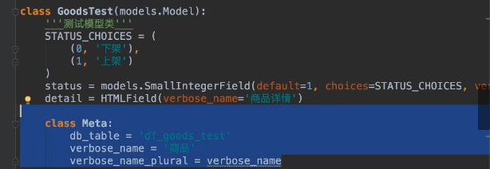

## 相关背景概念

> B2B, O2O, B2C, C2C..

## 数据库设计

> 对数据库进行授权
> 

> 使用后台管理
>

## 项目搭建

**1.一个模块对应一个APP**
**2.将所有app归类到一个apps文件夹**
**3.\[可选\]  设置一个系统路径，这样就不用注册APP时添加前缀文件夹**
	
	>sys.path.insert(0, os.path.join(BASE_DIR, 'apps'))

**4.添加templates包和static包**
>TEMPLATES_DIR = os.path.join(BASE_DIR, 'templates')
>TEMPLATES = [
    {
        'BACKEND': 'django.template.backends.django.DjangoTemplates',
        'DIRS': [TEMPLATES_DIR],
		...
> STATICFILES_DIR = [os.path.join(BASE_DIR, 'static')]

**5.添加templates和static路径到setting**

**6.配置数据库为Mysql**

>   'ENGINE': 'django.db.backends.mysql',
        'NAME': 'dailyfresh',
        'USER': 'root',
        'PASSWORD':'bk102435',
        'HOST':'39.97.170.176',
        'PORT':3306,
	
**7.设置语言**
LANGUAGE_CODE = 'zh-hans'
TIME_ZONE = 'Asia/Shanghai'

**8.配置项目总的urls**
**9.为各应用创建urls**

**10.数据层准备，创建db包，创建basemodel.py**

**11.\[可选\]创建各models 或 链接现有数据库**

> Inpectdb 也可针对某张表：
> python manage.py inspectdb TableName > output.py
> 链接： https://www.jianshu.com/p/037bd7e20a7a

**12.指定django认证系统的模型**
这样superuser的模型表就被指定到自己的user表
> settings.py中加入 
> AUTH_USER_MODEL = ‘user.User’

###  13.  可能出现的问题
不确定是不是使用pymysql导致的，这里会有两个问题
*  1.现在django使用mysqlclient，而且恶心的是会在启动时自动验证版本号，pymysql最高只到0.9.3。这里根据报错直接那代码注释即可！
*  2.makemigration出错，提示在django代码里的operations.py中的last_executed_query函数，由于python3与Python2的decode与encode函数区别，这里也需要把.decode..去掉。

	
	 
